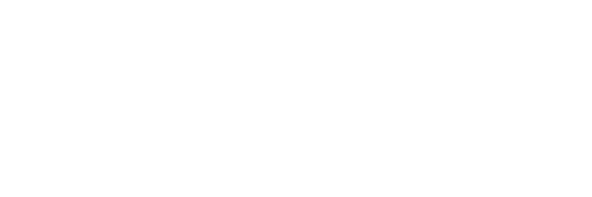

# Football Club Management App

Desktop application for managing a football club.
Developed as a lab project for the Software Engineering class.

Iteration 1 includes admin dashboard (managing clubs & accounts) and squad list (add player, view player profile, update player profile).
Future iterations will include contractual side, injuries & schedule (both matches and training).

Written in plain Java with JavaFX, XML, CSS for UI part, relying on Gradle for dependencies & build. 
